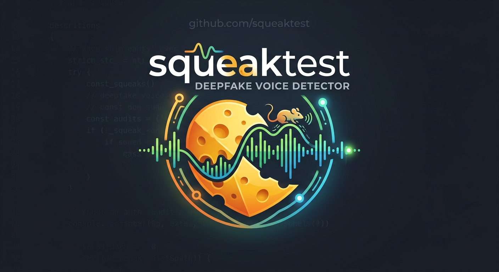

# squeaktest



> Real curds squeak. Fakes don't.

**squeaktest** estimates whether speech in an audio clip is synthetic (AI-generated or voice-cloned). Instead of a yes/no verdict, it gives a probability score in one of three bands (*Likely synthetic*, *Uncertain*, *Likely genuine*) and shows which parts of the clip look suspicious. Its accuracy is measured on audio and generators it wasn't trained on, and all results are published, including the weak ones. Voice counts as biometric data, so uploads are processed in memory, never stored, and never logged. It runs locally through a CLI or Docker, or on the web.

## Status

Early development (Phase 1: command-line tool). The hardened audio loader is in place; there is no detection model yet. No accuracy claims are made until evaluation results are published here.

The research behind the model and dataset choices is in [docs/research.md](docs/research.md).

## Development

You need [uv](https://docs.astral.sh/uv/) and [ffmpeg](https://ffmpeg.org/) (including `ffprobe`) on your PATH.

```bash
uv sync          # create the virtual environment from uv.lock
uv run pytest    # run the tests
```

Test audio is synthetic (tones generated by ffmpeg at test time). The repository never contains real voice recordings.

## License

Code: [MIT](LICENSE). The detection models planned for squeaktest are licensed for non-commercial use only (CC BY-NC-SA 4.0); see [docs/research.md](docs/research.md).
